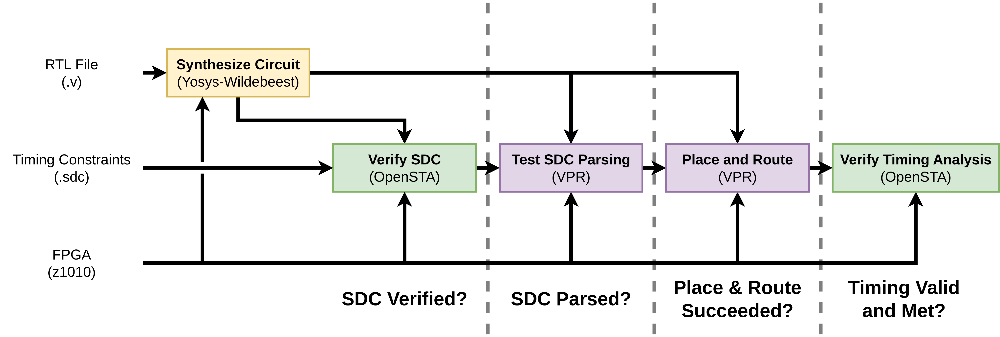

# FPGA Timing Benchmarks

This is an open source collection of timing constraint files targeted towards
qualifying the timing capabilities of an FPGA CAD flow, such as VTR.
Provided is also a set of scripts which can run these benchmarks on VPR, targeting
Zero ASIC's z1010 architecture; however, this can be used to target any VTR-compatible
architecture.



## Getting Started

### Tools Installation

The scripts require some CAD tools in order to run and test the benchmarks. We
will be using the SiliconCompiler project to manage the tools and versions.
The following commands should install the correct versions of the tools that this
project requires..
```
# Optional: Create a python virtual environment.
python3 -m venv .venv
source .venv/bin/activate

# Install this directory as a Python module.
pip install .

# Install siliconcompiler.
pip install --upgrade siliconcompiler

# Install necessary tools using SiliconCompiler (these should update your PATH).
sc-install yosys-wildebeest opensta vpr
```

### Architecture Download

For the tests in this benchmark, we will run them on Zero ASIC's z1010 architecture.
The choice of architecture was somewhat arbitrary; however, we do need an architecture
that has the necessary liberty files which can be used for post-implementation
timing analysis. This architecture is also built-into Wildebeest right now,
so it is slightly more convenient.
The following commands will download the latest release of the z1010 architecture
and untar it into this directory.
```
wget https://github.com/siliconcompiler/logiklib/releases/download/v0.2.0/z1010_cad.tar.gz
tar -xvzf z1010_cad.tar.gz
```

### Running the Benchmarks

```py
# Run the benchmarks through the test suite.
python3 run_syntax_suite.py

# The results are returned as a CSV file in a run directory.
# Optional: These results can be visualized using the following script:
pip install .[vis_scripts]
python3 scripts/visualize_results.py --input runs/run001/results.csv --output runs/run001/results.png
```
